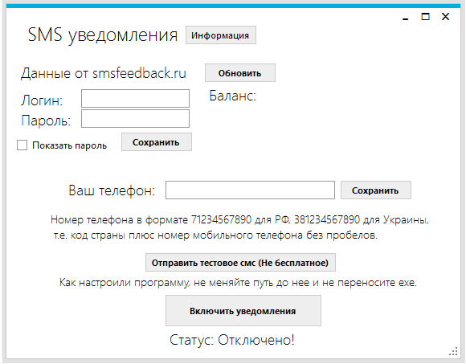

## Уведомления по смс при включении компьютера ##

Готовый exe лежит в Release(Done EXE)
Программа работает через http://www.smsfeedback.ru
При регистрации дают бесплатные 10р, хватит на несколько смс.
Тестирования программы проводилось на windows 10. На других ос, за роботу программы не ручаюсь.

Формат смс: "Выполнен вход. Пользователь: {UserName}. {DateTime.Now}"

